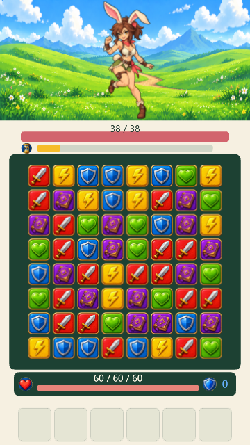
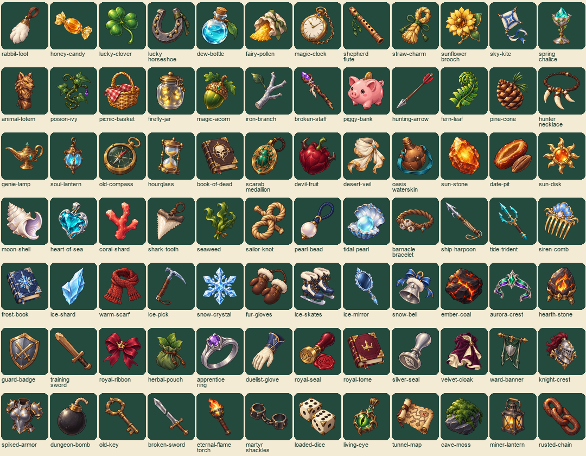
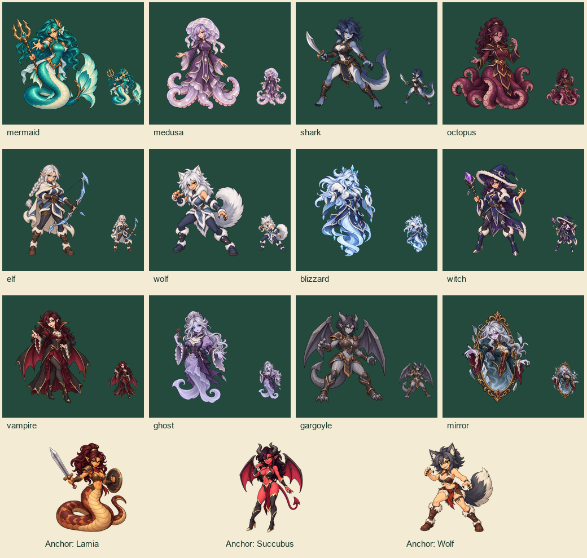
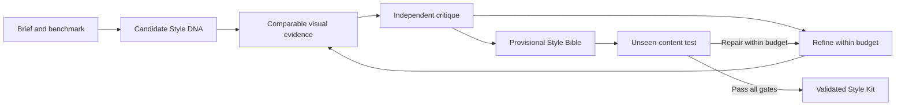

# Art Director Loop

By [@Atmosaero](https://github.com/Atmosaero).

An agent skill for discovering, refining, and validating a coherent **2D game art style**. It turns art direction into explicit construction rules, tests those rules across the whole game's visual system, and delivers a reusable **Style Kit** for making more content.

A character, a potion, a tiny gameplay tile, and a disabled button have different jobs. Art Director Loop checks whether they share a visual language while remaining readable at their actual display sizes. The real test comes when another maker uses the written rules to create assets the style has never been tested on.

The repository is called **Art Director Loop**; the installed skill and invocation name are **`style-loop`**.

## Example style

<p align="center">
  
</p>
<p align="center">
  
</p>
<p align="center">
  
</p>


A portrait match-3 combat screen illustrates the scope: character art, an environment, gameplay pieces, and interface elements appear together. The workflow evaluates their construction, hierarchy, and readability as one system. This screenshot is a style example; a validated result also includes the benchmark, new-content evidence, and verdicts described below.

## How the loop works

1. **Define the brief and benchmark.** Inspect the game, preserve its identity where required, and freeze comparable subjects, UI states, layouts, target sizes, and production constraints.
2. **Explore distinct directions.** In discovery mode, compare four candidates by default. Each gets written Style DNA: shape, contour, palette, shading, material, detail, and scale rules. Differences must go beyond recoloring.
3. **Render and judge the same content.** Build equivalent sheets covering characters, items, gameplay elements, backgrounds, UI, and composed screens. Inspect native-size evidence. Fresh critics review neutral evidence packets and identify concrete failures.
4. **Refine the visual system.** Shortlist up to two directions, fix the highest-impact issues, and retest affected domains. Preserve earlier versions and track regressions. Stalled candidates get at most one structural rescue.
5. **Freeze a provisional Style Bible and test transfer.** A fresh maker receives only the Bible, reference anchors, and a new-content brief. It creates unseen subjects and screen content; an independent critic checks the result against the same gates.
6. **Deliver the Style Kit.** Package the rules, anchors, tokens, recipes, and evidence. Report exactly what passed and what remains unresolved.



## When to use it

Art Director Loop tests whether one art direction can hold together across a growing game's content. It compares equivalent assets at actual display sizes, then checks whether new content can be made from the frozen rules and anchors.

Use this skill for art-direction exploration, inconsistent asset families, style documentation, or extending an established style. Standalone illustrations and pixel-perfect screenshot recreation are outside its scope.

## Installation

With the [Skills CLI](https://github.com/vercel-labs/skills):

```sh
npx skills add Atmosaero/art-director-loop --skill style-loop
```

Or clone the repository into your agent's skills directory, naming the folder `style-loop`:

```sh
git clone https://github.com/Atmosaero/art-director-loop.git <your-skills-directory>/style-loop
```

Keep `SKILL.md`, `agents/`, and `references/` together. This repository contains the skill instructions; each game's working artifacts live in that game's `.style-loop/` directory.

## Prerequisites

Use an agent with:

- Project file access and vision, including inspection at controlled gameplay sizes.
- A way to produce visible test artifacts: image generation, existing assets, or suitable 2D rendering tools. Code-native UI can use the project's renderer.
- Fresh maker and judge contexts with image access for full independent validation. Subagents are preferred; self-review is a disclosed fallback and leaves the result provisional.

No specific image provider or game engine is required. Text-only prompts cannot establish visual quality; without inspectable visual evidence, the skill returns an unvalidated plan and rules.

## Example prompts

**Discover a direction**

> Use $style-loop to explore a visual style for our portrait 2D fantasy match-3 game. Compare four structurally different directions across a character, items, six tiles, backgrounds, and UI. Test at our actual gameplay sizes, then deliver a Style Kit with its validation status. Keep the session within 45 minutes.

**Refine an existing game**

> Use $style-loop to make our characters, item icons, and UI feel like one game. Preserve the current character identity and palette. Identify the construction rules that clash, compare targeted fixes against the baseline, and validate the strongest direction on new content.

**Validate or extend a style**

> Use $style-loop to audit our existing Style Bible before we add a new character, a new item family, and a results screen. Test whether another maker can produce them from the Bible and anchors alone. Propose rule changes only where the evidence fails.

To resume, ask the agent to continue the existing `.style-loop/` run. It recovers evidence, decisions, pending work, and consumed budgets from the ledger.

## What you get

A portable, versioned kit that can be handed to another artist or agent:

```text
.style-loop/kit/v01/
  style-bible.md   # Resolved construction rules, scale policy, version and status
  anchors/        # Examples across asset families, with native-size companions
  tokens.json     # Palette roles, line weights, spacing, radii, typography, shading
  recipes.md      # Production steps, prompt skeletons, exports, acceptance checks
  validation.md   # Coverage, scores, production effort, limitations and verdicts
  evidence/       # Final sheets, native views, manifests and corresponding verdicts
```

The full run also retains candidate DNA, comparisons, revision history, and failed tests. The released kit uses local links so it can travel independently of the original conversation.

## Validation and limits

Critics score five dimensions: cross-domain consistency (3 points), visual grammar (2), gameplay readability (2), generalization (2), and reproducibility (1).

Both the original benchmark and unseen-content test must reach **8.5/10**, meet every dimension's minimum, and have no major blocker. The Bible audit, production allowance, and independent maker/judge evidence must also pass. See the [exact gates](references/workflow.md#6-provisional-lock-and-independent-transfer-test) and [judging rubric](references/judge.md#scoring-rubric).

- **Validated:** the same frozen Bible passes all required checks and independent transfer.
- **Provisional:** visual evidence exists, but a gate, transfer test, independence requirement, budget, or review remains unresolved.
- **Unvalidated:** visual evidence or inspection is unavailable; no numerical verdict or validation claim is made.

The loop is bounded. Defaults are six shared refinement rounds, one structural rescue per candidate, two stress attempts, 18 sheet/package attempts, 48 image-generation calls, and 24 judge calls. These are ceilings, not promised usage; user time and cost limits also apply. Resuming or failing a test does not reset consumption. Reaching a limit preserves the best evidence and reports the unmet gate.

Validation covers the tested visual system. Animation, engine integration, and editable production assets are covered only when actually checked.

## Skill reference

Start with [SKILL.md](SKILL.md). Detailed instructions are loaded as needed:

- [Workflow](references/workflow.md): modes, persistent state, budgets, refinement, and exit gates.
- [Benchmark](references/benchmark.md): comparable sheets, actual-size checks, and unseen-content coverage.
- [Style DNA](references/style-dna-template.md): explicit rules for each candidate.
- [Judge](references/judge.md): independent evidence packets, scoring, and actionable verdicts.
- [Style Bible](references/style-bible-template.md): standalone production guidance and handoff audit.

## Contributing

Feedback, example results, and improvements to the skill are welcome. For workflow changes, include the brief, comparable visual evidence, relevant verdicts, and final status so reviewers can assess consistency, readability, and transfer behavior.
